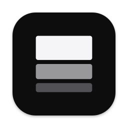
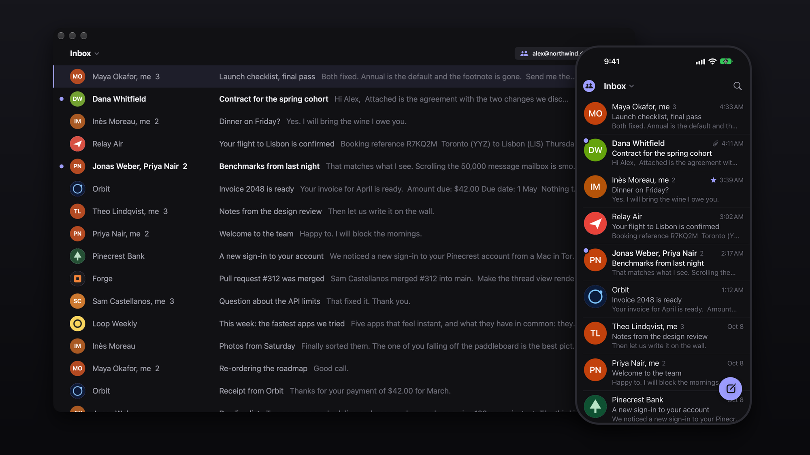

<p align="center">
  
</p>

<h1 align="center">Mach</h1>

<p align="center">
  The instant mail app for Gmail and Outlook. Free for personal use, source open, native on Mac and iPhone.
</p>

<p align="center">
  <a href="https://github.com/ahmedkhaleel2004/mach/releases/latest"><b>Download for Mac</b></a>
  &nbsp;·&nbsp; <a href="#iphone">iPhone</a>
  &nbsp;·&nbsp; <a href="#shortcuts">Shortcuts</a>
  &nbsp;·&nbsp; <a href="bench/RESULTS.md">Benchmarks</a>
</p>



Mach keeps your mail in a database on your device, so nothing you do waits for the network. Lists, conversations and
search answer before the next frame; what you did is sent to Gmail behind you. There are no spinners and almost no
animation: things are simply there.

## Fast, measured

Medians on a mailbox of 50,000 messages. Every number has a benchmark behind it in [`bench/`](bench/RESULTS.md).

| | |
|---|---|
| Search 50,000 messages | **2 ms** |
| Typing in search, time the app is busy per letter | **0.7 ms** |
| Open a heavy newsletter | **17 ms** |
| Open a 200-message conversation | **48 ms** |
| Move down the list, per key | **2.3 ms** |
| Archive 50 conversations at once | **14 ms** |
| Read the inbox from disk | **0.5 ms** |
| First mail on screen after a brand-new sign-in | **0.5 s** |
| New mail on screen after Gmail announces it (with the relay) | **0.25 s** |
| The whole app | **4.6 MB** on Mac, **4.5 MB** on iPhone |

## What it feels like

- **One inbox, or all of them.** Every account in a single list, or one at a time. Split Inbox is a switch, off by default.
- **Keyboard first on Mac.** Gmail's own shortcuts, a command bar on `⌘K`, and nothing that needs the mouse.
- **Swipes on iPhone.** Left to archive, right to mark read, both changeable; one swipe, no confirm. Swipe anywhere on an
  open email to go back. Everything follows your finger at 120 Hz and ticks when it takes.
- **Sign-in codes, one tap.** A mail that carries a code shows it in its row and on its banner; tap it (or `⇧C`) and it is copied.
- **Undo everything.** Archive, trash, snooze, and sending for five seconds.
- **Real faces.** The sender's Google picture, or a company's certified logo, the way Gmail shows them. Tap to enlarge.
- **Attachments you can see.** A preview on every file; a tap opens it in Quick Look.
- **Search everything.** Instant on the device, with Gmail's own search folded in as you scroll. Best match, newest or oldest.
- **Drafts and snoozes live on Gmail,** so they are on every device and in Gmail itself.
- **Works offline.** Changes apply at once and go to Gmail when you are back.
- **Light and dark,** and a size slider on both platforms.

## Install

### Mac

[Download the latest release](https://github.com/ahmedkhaleel2004/mach/releases/latest), open the disk image and drag Mach
to Applications. It is signed and notarized, and keeps itself up to date. Needs an Apple silicon Mac on macOS 15 or newer.

Sign-in needs a Google key of your own for now (five minutes, once): Google only lets an app read Gmail for the public
after a paid security review, which Mach has not been through yet.

1. In the [Google Cloud console](https://console.cloud.google.com) create a project, enable the **Gmail API** and the
   **People API**, and create an OAuth client of type **Desktop app**. Add yourself as a test user.
2. Save the client's JSON as `~/Library/Application Support/Mach/OAuthClient.json` and open Mach.

**Outlook** (outlook.com, hotmail.com, live.com, and work or school accounts) works out of the box: press
**Sign in with Microsoft**. Mach ships with its own Microsoft app registration, whose id is not a secret. To use
one of your own instead (accounts in any organization and personal accounts; a "Mobile and desktop" redirect of
`http://localhost`, and `com.ahmedkhaleel.mach://oauth` for the iPhone), save `{"client_id": "<its id>"}` as
`~/Library/Application Support/Mach/MicrosoftClient.json` (`App/Resources/MicrosoftClient.json` when building the
iPhone app). The push relay watches Outlook accounts as well as Gmail ones.

### iPhone

There is no App Store or TestFlight build yet, so today the iPhone app is built from source with Xcode (free Apple
account: the app lasts a week per install; paid: a year).

The iPhone signs in with a Google OAuth client of type **iOS** (in the same Google Cloud project, with the app's
bundle id), not the Desktop one: it has no secret, and Google answers on an address only the app opens. Save its id as
`App/Resources/OAuthClient.json`:

```json
{ "client_id": "1234-abcd.apps.googleusercontent.com" }
```

To build the Mac and the iPhone app from one checkout, keep the Desktop client's JSON and add the iOS client beside
`"installed"`: `"ios": { "client_id": "…" }`. Each app takes its own. The file is git-ignored; never commit it.

```sh
brew install xcodegen
git clone https://github.com/ahmedkhaleel2004/mach && cd mach
cp /path/to/your/ios-client.json App/Resources/OAuthClient.json
cd App && xcodegen generate && open Mach.xcodeproj   # set your team, run MachPhone on your iPhone
```

Instant notifications on a closed iPhone need the small relay in [`Relay/`](Relay/README.md), on your own free
Cloudflare account. Without it the phone checks when opened and in background refresh.

The build for the App Store is the `Store` configuration (`scripts/upload-testflight.sh`). It has no relay in it at
all, so nothing about your account goes anywhere but Google, and it refuses to build without an iOS client.

## Shortcuts

| | |
|---|---|
| `j` `k` | Next, previous |
| `Enter` / `Esc` | Open / back |
| `e` | Archive |
| `#` | Trash |
| `s` | Star |
| `b` | Snooze |
| `r` `a` `f` | Reply, reply all, forward |
| `c` | Compose |
| `z` | Undo |
| `/` | Search |
| `⌘K` | Command bar |
| `1`–`9` | Switch list |
| `⌃1`–`⌃9` | Switch account |
| `?` | All shortcuts |

## How it is built

- **`Core/`** is a Swift package with no interface: the Gmail client, a SQLite store with full-text search (GRDB),
  two-way sync and the outbox. `cd Core && swift test`.
- **`App/`** is the SwiftUI app both platforms share, with a thin layer each for the Mac window and the iPhone screen.
- An open conversation is one web view that never unloads, so opening an email is a function call, not a page load.
  Each message sits in its own shadow root under a policy that runs no scripts from mail.
- Sync is shaped around Gmail's small per-minute allowance: newest mail first, changes read from Gmail's change log,
  bulk actions as one request, and an adaptive pace that never trips the limit.
- **`Relay/`** is an optional Cloudflare Worker that turns Gmail's "new mail" signal into an Apple push.
- **`bench/`** holds the benchmarks and every result, including what did not get faster.

The only Google permissions asked for are reading and changing mail, and reading contact pictures. Your mail stays on
your devices; nothing goes anywhere but Google (and your own relay, if you run one).

## Not done yet

- One-click sign-in for everyone, and an iPhone build on TestFlight.
- Writing is plain text; links become clickable and the quoted original keeps its formatting.
- A label picker.
- A switch to stop remote pictures loading (they can tell a sender you opened their mail).

## License

Free for personal and other noncommercial use, with the source open to read, change and share on the same terms
([PolyForm Noncommercial 1.0.0](LICENSE)). Using Mach in or for a business needs a commercial license:
[email Ahmed](mailto:ahmed@gitdiagram.com).

Built by [Ahmed Khaleel](https://x.com/ahmedkhaleel04), who also made [GitDiagram](https://gitdiagram.com).
